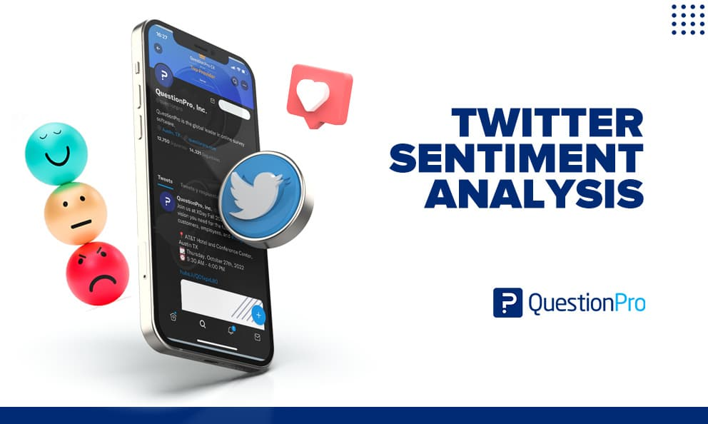
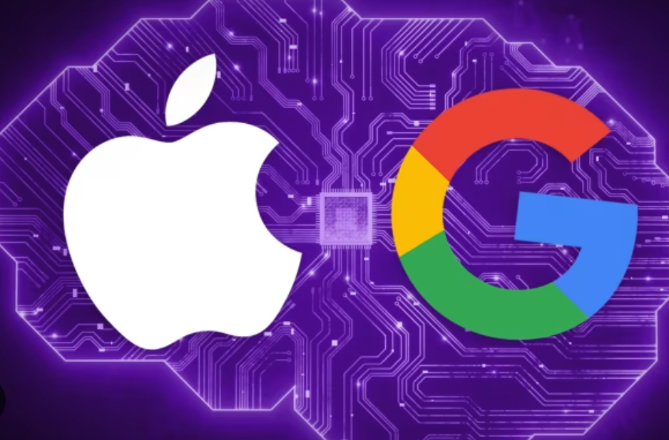
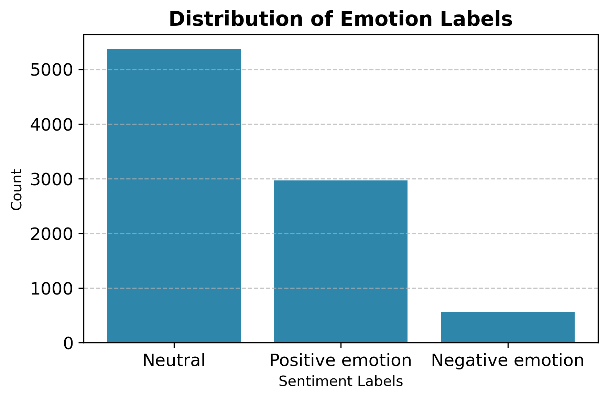
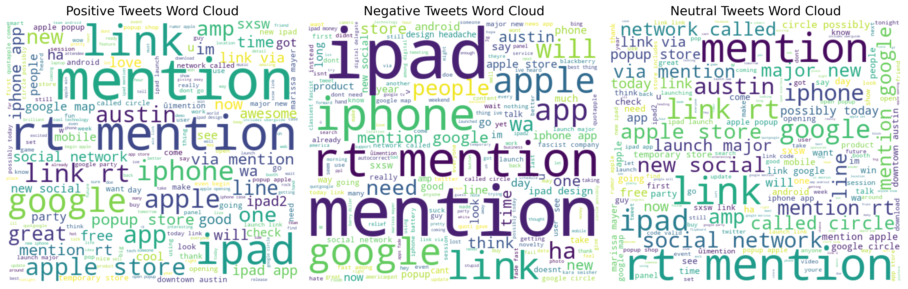
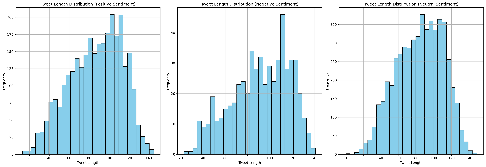

# Credit Card Fraud Detection: A Machine Learning Approach for Financial Institutions

**Student:** Riché FLEURINORD  
**Program:** Data Science & AI – First Cohort (2025)  
**Project:** ADVANCED MACHINE LEARNING - Phase 4 
**GitHub Repository:** https://github.com/richefleuriord/Ds_Twitter_Sentiment_Analysis.git 

**Instructors:** Wedter JEROME & Geovany Batista Polo LAGUERRE  
**Submission Deadline:** September 17, 2025  

---

#  Natural Language Processing Approach to Twitter Sentiment Analysis: Apple and Google products

📸 **

---

## 🔍 Overview  
This project analyzes Twitter sentiment toward Apple and Google products using Natural Language Processing (NLP) techniques.  
The main objective is to develop machine learning models capable of classifying tweets as **positive**, **negative**, or **neutral** based on their content, helping stakeholders understand public perception surrounding these two technology giants.

---

## 💼 Business Understanding  

📸 **

In the competitive landscape of global technology, public sentiment significantly shapes the brand image and strategic decisions of companies like **Apple** and **Google**.  
This analysis seeks to uncover how users express their opinions on Twitter regarding these brands, particularly in relation to product launches and performance.  

Both companies operate at massive scales — Apple reported revenues exceeding **$300 billion**, while Google’s parent company, **Alphabet**, surpassed **$181 billion** last year.  
Monitoring sentiment enables these corporations to align marketing efforts, enhance customer engagement, and refine product development strategies.  

The core problem addressed is transforming large-scale unstructured data (tweets) into actionable insights.  
Understanding how users feel about their products allows these companies to detect weaknesses, reinforce strengths, and predict future market reactions.  

Stakeholders such as Apple’s and Google’s marketing teams, investors, and analysts can use these insights for decision-making, while consumers benefit from gauging overall sentiment before making purchase decisions.

---

## 🧹 Data Preparation  
In this stage, we prepared the dataset for sentiment analysis by:  
- Removing irrelevant columns such as `emotion_in_tweet_is_directed_at`  
- Dropping ambiguous sentiment categories (“I can’t tell”, “No emotion toward brand or product”)  
- Cleaning and standardizing text: removing URLs, hashtags, punctuation, converting to lowercase, and applying tokenization and lemmatization  
- Handling missing values and duplicates  
- Vectorizing text using **TF-IDF**, converting raw text into numerical format for model training

- 📸 **
  

**Summary:**  
This process ensured that our data was clean, consistent, and machine-readable, forming a solid foundation for the modeling phase.

---

## 📊 Exploratory Data Analysis (EDA)  
We conducted an in-depth Exploratory Data Analysis to better understand the sentiment distribution and linguistic structure of tweets.  

**Key steps included:**  
- Visualizing sentiment distribution across positive, negative, and neutral classes  
- Creating **word clouds** for each sentiment to reveal dominant words and themes  
- Analyzing tweet lengths to study message density and tone

- 📸 **

- 📸 **

- 📸 **

**Summary:**  
EDA provided both quantitative and qualitative insights into sentiment trends, word frequency, and message patterns, guiding our choice of preprocessing techniques and models.

---

## 🤖 Modelling  
We employed several machine learning algorithms to classify tweet sentiment effectively:  
- **Baseline Model – Naive Bayes:** Established a benchmark for performance.  
- **SVM and Random Forest:** Used to handle class imbalance and improve recall for negative tweets.  
- **Logistic Regression:** Evaluated for balanced accuracy across sentiment categories.  
- **Hyperparameter Tuning (GridSearchCV):** Applied to optimize model parameters and improve results.  

The models were tested in both **binary** and **multiclass** setups to ensure robustness and scalability.

---

## 📈 Evaluation  
**Binary Sentiment Analysis:**  
The **Random Forest** model achieved the best results with an accuracy of **88.84%**, effectively balancing precision and recall between positive and negative sentiments.  

**Multiclass Sentiment Analysis:**  
**Logistic Regression** outperformed others with an accuracy of **69.1%**, demonstrating consistent and stable performance across sentiment categories.  

Our findings highlighted key influencing factors such as frequent keywords, tone polarity, and engagement volume — offering actionable insights for marketing, product design, and investor analysis.

---

## 💡 Recommendations  
1. **Implement Real-Time Sentiment Tracking**  
   Deploy an automated system to monitor Twitter sentiment continuously and detect public perception shifts promptly.  

2. **Leverage Insights for Product Development**  
   Use sentiment data to identify positively and negatively received features, informing future design and innovation strategies.  

3. **Strengthen Brand Reputation Management**  
   Establish alert systems for spikes in negative sentiment to enable immediate PR responses and maintain consumer trust.  

4. **Enhance Marketing Strategy**  
   Design campaigns that amplify positive feedback and address criticism transparently.  

5. **Encourage User Engagement**  
   Actively respond to feedback on social media to convert negative experiences into opportunities for improvement and loyalty.

---

## 🔮 Next Steps  
Future work will focus on expanding the project’s analytical depth and real-world applicability.  
Specifically:  
- Integrate **real-time sentiment analysis** via Twitter’s API for continuous monitoring  
- Retrain models periodically with new tweets to adapt to evolving language patterns  
- Incorporate **advanced NLP techniques** such as BERT or RoBERTa for improved contextual understanding  
- Develop an **interactive dashboard** to visualize sentiment trends and performance metrics  
- Extend analysis to **additional social platforms** (e.g., Reddit, YouTube) for broader insights

---

## 📂 Resources  
- **Data:** tweets.csv --> CrowdFlower (via [data.world](https://data.world))  
- **Language:** Python  
- **Notebook:** Final_Phase4.ipynb
- **images**
- **Final_Phase4.pdf**
- **Final_Presentation.pdf**
- **License**
- **Readme.md**  

---

## ⚖️ License  
This project is released under the **MIT License** — open for use, modification, and distribution.

---

## 👤 Author  
**Riché Fleurinord**  
*Data Science & Economist-Statistician*  
📧 richefleurinord20@gmail.com  

🌐 https://github.com/richefleuriord/Ds_Twitter_Sentiment_Analysis.git
